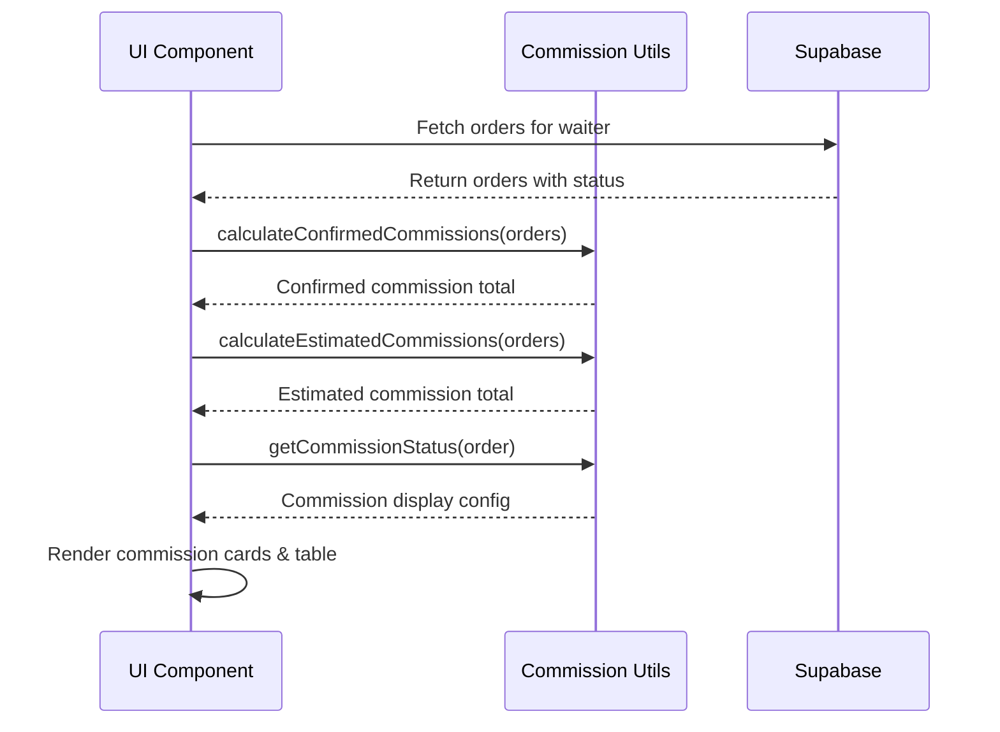
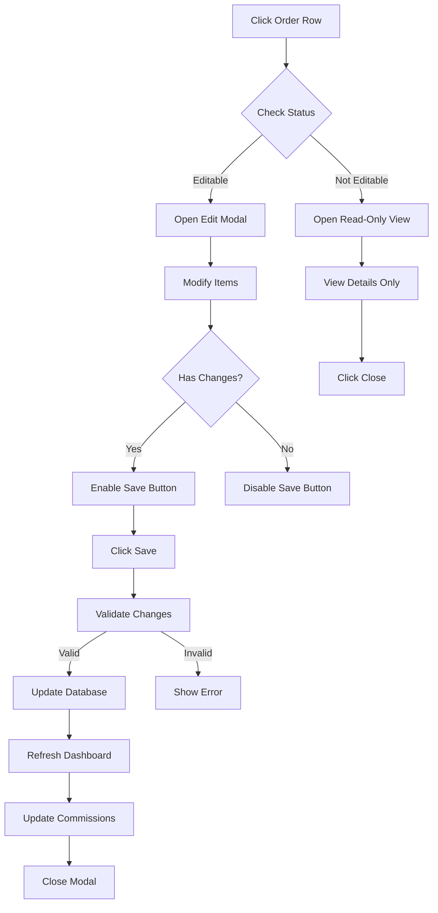

# Design Document

## Overview

This design implements a payment-aware commission tracking system that distinguishes between confirmed commissions (from paid orders) and estimated commissions (from pending orders). The solution ensures accurate financial reporting while providing visibility into potential future earnings.

The system will introduce a clear separation between confirmed and estimated commissions across both the Waiter Dashboard and Admin Reports interfaces, with consistent calculation logic and visual indicators to help users understand commission status at a glance.

## Architecture

### High-Level Architecture

```
┌─────────────────────────────────────────────────────────────┐
│                     Presentation Layer                       │
│  ┌──────────────────────┐    ┌──────────────────────────┐  │
│  │  WaiterDashboard     │    │  AdminWaiterReports      │  │
│  │  - Commission Cards  │    │  - Stats Cards           │  │
│  │  - Order Table       │    │  - Order Table           │  │
│  └──────────────────────┘    └──────────────────────────┘  │
└─────────────────────────────────────────────────────────────┘
                            │
                            ▼
┌─────────────────────────────────────────────────────────────┐
│                      Business Logic Layer                    │
│  ┌──────────────────────────────────────────────────────┐  │
│  │         Commission Calculation Utilities             │  │
│  │  - calculateConfirmedCommissions()                   │  │
│  │  - calculateEstimatedCommissions()                   │  │
│  │  - getCommissionStatus()                             │  │
│  │  - ORDER_STATUS_CATEGORIES                           │  │
│  └──────────────────────────────────────────────────────┘  │
└─────────────────────────────────────────────────────────────┘
                            │
                            ▼
┌─────────────────────────────────────────────────────────────┐
│                        Data Layer                            │
│  ┌──────────────────────────────────────────────────────┐  │
│  │              Supabase Orders Table                   │  │
│  │  - id, total_amount, status, waiter_id              │  │
│  │  - commission_amount, created_at                     │  │
│  └──────────────────────────────────────────────────────┘  │
└─────────────────────────────────────────────────────────────┘
```

### Component Interaction Flow



## Components and Interfaces

### 1. Commission Utilities Module

**Location:** `src/lib/commissionUtils.ts`

This centralized module will contain all commission calculation logic to ensure consistency across the application.

```typescript
// Order status categories
export const ORDER_STATUS_CATEGORIES = {
  PAID: ['paid', 'completed'],
  PENDING: ['pending', 'pending_payment', 'in_preparation', 'ready'],
  EXCLUDED: ['cancelled', 'expired']
} as const;

// Commission rate constant
export const COMMISSION_RATE = 0.1; // 10%

// Calculate confirmed commissions (from paid orders only)
export function calculateConfirmedCommissions(orders: Order[]): number {
  return orders
    .filter(order => ORDER_STATUS_CATEGORIES.PAID.includes(order.status.toLowerCase()))
    .reduce((sum, order) => sum + (Number(order.total_amount) * COMMISSION_RATE), 0);
}

// Calculate estimated commissions (from pending orders)
export function calculateEstimatedCommissions(orders: Order[]): number {
  return orders
    .filter(order => ORDER_STATUS_CATEGORIES.PENDING.includes(order.status.toLowerCase()))
    .reduce((sum, order) => sum + (Number(order.total_amount) * COMMISSION_RATE), 0);
}

// Get commission display configuration for an order
export function getCommissionStatus(order: Order): CommissionDisplayConfig {
  const status = order.status.toLowerCase();
  const commissionAmount = Number(order.total_amount) * COMMISSION_RATE;
  
  if (ORDER_STATUS_CATEGORIES.PAID.includes(status)) {
    return {
      amount: commissionAmount,
      displayAmount: commissionAmount.toLocaleString("pt-BR", { style: "currency", currency: "BRL" }),
      status: 'confirmed',
      className: 'text-green-600 font-semibold',
      icon: 'CheckCircle',
      tooltip: 'Comissão confirmada'
    };
  }
  
  if (ORDER_STATUS_CATEGORIES.PENDING.includes(status)) {
    return {
      amount: commissionAmount,
      displayAmount: commissionAmount.toLocaleString("pt-BR", { style: "currency", currency: "BRL" }),
      status: 'pending',
      className: 'text-yellow-600 font-semibold',
      icon: 'Clock',
      tooltip: 'Comissão estimada - aguardando pagamento'
    };
  }
  
  // Excluded statuses
  return {
    amount: 0,
    displayAmount: 'R$ 0,00',
    status: 'excluded',
    className: 'text-gray-400 line-through',
    icon: 'XCircle',
    tooltip: 'Pedido cancelado - sem comissão'
  };
}

// Get filtered orders by category
export function getOrdersByCategory(orders: Order[], category: keyof typeof ORDER_STATUS_CATEGORIES): Order[] {
  return orders.filter(order => 
    ORDER_STATUS_CATEGORIES[category].includes(order.status.toLowerCase())
  );
}
```

### 2. Commission Display Component

**Location:** `src/components/CommissionDisplay.tsx`

A reusable component for displaying commission information with proper styling and tooltips.

```typescript
interface CommissionDisplayProps {
  amount: number;
  status: 'confirmed' | 'pending' | 'excluded';
  showIcon?: boolean;
  size?: 'sm' | 'md' | 'lg';
}

export function CommissionDisplay({ amount, status, showIcon = true, size = 'md' }: CommissionDisplayProps) {
  const config = getCommissionStatus({ total_amount: amount / COMMISSION_RATE, status } as Order);
  
  return (
    <div className="flex items-center gap-2">
      {showIcon && <Icon name={config.icon} className="w-4 h-4" />}
      <span className={config.className}>
        {config.displayAmount}
      </span>
      <Tooltip content={config.tooltip} />
    </div>
  );
}
```

### 3. Enhanced Commission Cards

**Location:** `src/components/CommissionCards.tsx`

Dedicated component for displaying commission statistics with confirmed and estimated breakdowns.

```typescript
interface CommissionCardsProps {
  orders: Order[];
}

export function CommissionCards({ orders }: CommissionCardsProps) {
  const confirmedCommission = calculateConfirmedCommissions(orders);
  const estimatedCommission = calculateEstimatedCommissions(orders);
  const paidOrdersCount = getOrdersByCategory(orders, 'PAID').length;
  const pendingOrdersCount = getOrdersByCategory(orders, 'PENDING').length;
  
  return (
    <div className="grid grid-cols-1 md:grid-cols-2 gap-4">
      {/* Confirmed Commissions Card */}
      <Card className="border-green-200 bg-green-50/50">
        <CardHeader>
          <CardTitle className="flex items-center gap-2 text-green-700">
            <CheckCircle className="w-5 h-5" />
            Comissões Confirmadas
          </CardTitle>
        </CardHeader>
        <CardContent>
          <div className="text-3xl font-bold text-green-600 mb-2">
            {confirmedCommission.toLocaleString("pt-BR", { style: "currency", currency: "BRL" })}
          </div>
          <p className="text-sm text-gray-600">
            De {paidOrdersCount} pedidos pagos
          </p>
        </CardContent>
      </Card>
      
      {/* Estimated Commissions Card */}
      <Card className="border-yellow-200 bg-yellow-50/50">
        <CardHeader>
          <CardTitle className="flex items-center gap-2 text-yellow-700">
            <Clock className="w-5 h-5" />
            Comissões Estimadas
          </CardTitle>
        </CardHeader>
        <CardContent>
          <div className="text-3xl font-bold text-yellow-600 mb-2">
            {estimatedCommission.toLocaleString("pt-BR", { style: "currency", currency: "BRL" })}
          </div>
          <p className="text-sm text-gray-600">
            De {pendingOrdersCount} pedidos pendentes
          </p>
          <p className="text-xs text-gray-500 mt-1">
            Aguardando confirmação de pagamento
          </p>
        </CardContent>
      </Card>
    </div>
  );
}
```

## Data Models

### Order Interface (Extended)

```typescript
interface Order {
  id: string;
  created_at: string;
  total_amount: number;
  status: string;
  customer_name?: string;
  customer_phone?: string;
  waiter_id?: string;
  commission_amount?: number; // Optional DB field, calculated if not present
}
```

### Commission Display Configuration

```typescript
interface CommissionDisplayConfig {
  amount: number;
  displayAmount: string;
  status: 'confirmed' | 'pending' | 'excluded';
  className: string;
  icon: string;
  tooltip: string;
}
```

### Commission Statistics

```typescript
interface CommissionStats {
  confirmed: {
    total: number;
    orderCount: number;
  };
  estimated: {
    total: number;
    orderCount: number;
  };
  total: {
    potential: number; // confirmed + estimated
    orderCount: number;
  };
}
```

## Implementation Details

### WaiterDashboard Updates

1. **Replace single commission card with dual cards:**
   - Confirmed commissions card (green theme)
   - Estimated commissions card (yellow theme)

2. **Update order table commission column:**
   - Add icon indicator for commission status
   - Apply color coding based on payment status
   - Add tooltip explaining commission status

3. **Update statistics calculations:**
   - Use `calculateConfirmedCommissions()` for confirmed total
   - Use `calculateEstimatedCommissions()` for estimated total
   - Display both metrics prominently

### AdminWaiterReports Updates

1. **Add commission breakdown to stats cards:**
   - Split existing commission card into two cards
   - Show confirmed vs estimated commissions
   - Display order counts for each category

2. **Update order table:**
   - Add visual indicators for commission status
   - Use consistent styling with WaiterDashboard

3. **Update CSV export:**
   - Add "Commission Status" column
   - Include separate columns for confirmed and estimated commissions
   - Add summary row with totals

### Visual Design Patterns

**Confirmed Commissions:**
- Color: Green (#10b981)
- Icon: CheckCircle
- Background: Light green tint
- Border: Green accent

**Estimated Commissions:**
- Color: Yellow/Orange (#f59e0b)
- Icon: Clock
- Background: Light yellow tint
- Border: Yellow accent

**Excluded Commissions:**
- Color: Gray (#9ca3af)
- Icon: XCircle
- Style: Strikethrough text
- Opacity: Reduced

## Error Handling

1. **Invalid Order Status:**
   - Default to 'excluded' category
   - Log warning for unknown status values
   - Display R$ 0,00 with gray styling

2. **Missing Commission Amount:**
   - Calculate from total_amount * COMMISSION_RATE
   - Log calculation for audit trail

3. **Data Fetch Errors:**
   - Display error toast to user
   - Show zero values with error indicator
   - Provide retry mechanism

4. **Calculation Precision:**
   - Round to 2 decimal places
   - Use Number() for type safety
   - Validate non-negative results

## Testing Strategy

### Unit Tests

1. **Commission Calculation Functions:**
   - Test with various order status combinations
   - Verify correct filtering by status category
   - Test edge cases (empty arrays, zero amounts)
   - Validate precision to 2 decimal places

2. **Status Categorization:**
   - Test all known order statuses
   - Verify case-insensitive matching
   - Test unknown status handling

3. **Display Configuration:**
   - Verify correct styling for each status
   - Test tooltip content generation
   - Validate icon selection logic

### Integration Tests

1. **WaiterDashboard:**
   - Test commission cards render correctly
   - Verify order table displays proper indicators
   - Test real-time updates when order status changes

2. **AdminWaiterReports:**
   - Test stats calculation with mixed order statuses
   - Verify CSV export includes all commission data
   - Test date range filtering with commission calculations

3. **Cross-Component Consistency:**
   - Verify identical calculations in both interfaces
   - Test that status changes propagate correctly
   - Validate visual consistency

### Manual Testing Scenarios

1. **Waiter creates order → payment confirmed:**
   - Commission moves from estimated to confirmed
   - Totals update correctly
   - Visual indicators change appropriately

2. **Order cancelled after creation:**
   - Commission removed from estimated
   - Displays as excluded in table
   - Totals recalculate correctly

3. **Multiple orders with mixed statuses:**
   - Confirmed and estimated totals are accurate
   - Order table shows correct status for each
   - Export includes proper breakdown

## Performance Considerations

1. **Calculation Optimization:**
   - Memoize commission calculations using useMemo
   - Calculate once per data fetch, not per render
   - Cache status category lookups

2. **Rendering Optimization:**
   - Use React.memo for CommissionDisplay component
   - Avoid unnecessary re-renders of commission cards
   - Lazy load icons

3. **Data Fetching:**
   - No additional database queries required
   - Use existing order data structure
   - Calculate commissions client-side

## Migration Strategy

1. **Phase 1: Add Utility Functions**
   - Create commissionUtils.ts
   - Add unit tests
   - No UI changes yet

2. **Phase 2: Update WaiterDashboard**
   - Replace commission calculation logic
   - Add dual commission cards
   - Update order table styling

3. **Phase 3: Update AdminWaiterReports**
   - Apply same calculation logic
   - Update stats cards
   - Enhance CSV export

4. **Phase 4: Validation**
   - Compare old vs new calculations
   - Verify consistency across interfaces
   - User acceptance testing

## Future Enhancements

1. **Commission History Tracking:**
   - Store commission snapshots in database
   - Track when commissions transition from estimated to confirmed
   - Generate commission payment reports

2. **Configurable Commission Rates:**
   - Support different rates per waiter
   - Time-based commission adjustments
   - Product-specific commission rules

3. **Commission Notifications:**
   - Alert waiters when estimated commissions are confirmed
   - Daily/weekly commission summaries
   - Payment reminders for managers

4. **Advanced Analytics:**
   - Commission trends over time
   - Comparison between waiters
   - Conversion rate from estimated to confirmed


## Phase 2: UX Improvements Design

### Mobile-First Commission Interface

#### Problem Statement
The current commission display has several UX issues:
1. **Performance card is redundant** - Shows average order value which is not critical for waiters
2. **Separate cards are cluttered** - "Comissões Confirmadas" and "Comissões Estimadas" take up too much space
3. **Table is not mobile-friendly** - Order history table doesn't work well on small screens

#### Solution Overview

**Toggle-Based Commission View:**
```
┌─────────────────────────────────────────┐
│  Comissões                              │
│  ┌─────────────┬─────────────┐         │
│  │  Recebidas  │  A Receber  │ ← Toggle│
│  └─────────────┴─────────────┘         │
│                                         │
│  R$ 150,00                              │
│  De 15 pedidos pagos                    │
│                                         │
│  Total Geral: R$ 165,50                 │
│  (Recebidas + A Receber)                │
└─────────────────────────────────────────┘
```

**Mobile Card Layout for Orders:**
```
┌─────────────────────────────────────────┐
│  #1234 • João Silva                     │
│  ┌───────────────────────────────────┐  │
│  │ R$ 50,00                          │  │
│  │ ✓ R$ 5,00 comissão                │  │
│  │ 13/11 23:45 • Pago                │  │
│  └───────────────────────────────────┘  │
└─────────────────────────────────────────┘
```

### Component Architecture

#### New Components

**1. CommissionToggle Component**
```typescript
interface CommissionToggleProps {
  orders: Order[]
  onViewChange?: (view: 'received' | 'pending') => void
}

// Features:
// - Toggle between received/pending views
// - Display selected commission amount
// - Show order count for selected view
// - Display overall total
// - Smooth animations
```

**2. MobileOrderCard Component**
```typescript
interface MobileOrderCardProps {
  order: Order
  onExpand?: () => void
}

// Features:
// - Compact card layout
// - Essential info visible
// - Expandable for details
// - Touch-friendly
// - Status indicators
```

### Responsive Breakpoints

```css
/* Mobile First Approach */
.commission-cards {
  /* Mobile: < 768px - Stack vertically */
  display: flex;
  flex-direction: column;
  gap: 1rem;
}

@media (min-width: 768px) {
  /* Tablet: 768-1024px - Side by side */
  .commission-cards {
    flex-direction: row;
  }
}

@media (min-width: 1024px) {
  /* Desktop: > 1024px - Full layout */
  .commission-cards {
    grid-template-columns: repeat(3, 1fr);
  }
}
```

### Visual Design Specifications

#### Toggle Switch Design
```
Active State:
┌─────────────┬─────────────┐
│ ● Recebidas │  A Receber  │
└─────────────┴─────────────┘
  Green bg      Gray bg

Inactive State:
┌─────────────┬─────────────┐
│  Recebidas  │ ● A Receber │
└─────────────┴─────────────┘
  Gray bg      Yellow bg
```

#### Mobile Card Design
```
Card Structure:
┌─────────────────────────────────────┐
│ Header: Order # + Customer          │ ← Bold, 16px
├─────────────────────────────────────┤
│ Body:                               │
│   Amount: R$ XX,XX                  │ ← Large, 20px
│   Commission: ✓ R$ X,XX             │ ← Icon + amount
├─────────────────────────────────────┤
│ Footer: Date + Status Badge         │ ← Small, 12px
└─────────────────────────────────────┘

Spacing:
- Padding: 16px
- Gap between elements: 12px
- Border radius: 12px
- Shadow: subtle elevation
```

### State Management

#### Toggle State
```typescript
const [commissionView, setCommissionView] = useState<'received' | 'pending'>('received')

const displayedCommission = commissionView === 'received' 
  ? calculateConfirmedCommissions(orders)
  : calculateEstimatedCommissions(orders)

const displayedOrders = commissionView === 'received'
  ? getOrdersByCategory(orders, 'PAID')
  : getOrdersByCategory(orders, 'PENDING')
```

#### Mobile Layout Detection
```typescript
const [isMobile, setIsMobile] = useState(false)

useEffect(() => {
  const checkMobile = () => {
    setIsMobile(window.innerWidth < 768)
  }
  
  checkMobile()
  window.addEventListener('resize', checkMobile)
  return () => window.removeEventListener('resize', checkMobile)
}, [])
```

### Implementation Strategy

#### Phase 2.1: Remove Performance Card
- Simple removal from WaiterDashboard
- Adjust grid layout
- No data changes needed

#### Phase 2.2: Implement Toggle Interface
- Create CommissionToggle component
- Replace dual cards with toggle
- Add state management
- Implement animations

#### Phase 2.3: Mobile Order Cards
- Create MobileOrderCard component
- Add responsive detection
- Implement conditional rendering
- Test on various devices

### Accessibility Considerations

1. **Toggle Switch**
   - Keyboard navigation support
   - ARIA labels for screen readers
   - Focus indicators
   - Touch target min 44px

2. **Mobile Cards**
   - Semantic HTML structure
   - Proper heading hierarchy
   - Color contrast ratios
   - Touch-friendly spacing

### Performance Considerations

1. **Conditional Rendering**
   - Only render mobile cards when needed
   - Use CSS media queries for styling
   - Avoid unnecessary re-renders

2. **Animation Performance**
   - Use CSS transforms for toggle
   - Hardware acceleration
   - Smooth 60fps transitions

### Testing Strategy

1. **Responsive Testing**
   - Test on iPhone SE (375px)
   - Test on iPhone 12 (390px)
   - Test on iPad (768px)
   - Test on desktop (1920px)

2. **Interaction Testing**
   - Toggle switch functionality
   - Card expansion/collapse
   - Touch vs mouse events
   - Keyboard navigation

3. **Visual Regression**
   - Screenshot comparison
   - Layout consistency
   - Animation smoothness
   - Color accuracy


## Phase 3: Order Editing Design

### Problem Statement
Waiters need the ability to modify orders before they are paid or completed. This includes adding items, removing items, or changing quantities to correct mistakes or accommodate customer requests.

### Solution Overview

**Order Edit Modal/Page:**
```
┌─────────────────────────────────────────────────┐
│  Editar Pedido #1234                      [X]   │
├─────────────────────────────────────────────────┤
│  Cliente: João Silva                            │
│  Status: Pendente                               │
├─────────────────────────────────────────────────┤
│  Itens do Pedido:                               │
│                                                 │
│  ┌───────────────────────────────────────────┐ │
│  │ Açaí 500ml                    R$ 15,00    │ │
│  │ [-] 2 [+]                     R$ 30,00    │ │
│  │                                    [🗑️]   │ │
│  └───────────────────────────────────────────┘ │
│                                                 │
│  ┌───────────────────────────────────────────┐ │
│  │ Granola                       R$ 3,00     │ │
│  │ [-] 1 [+]                     R$ 3,00     │ │
│  │                                    [🗑️]   │ │
│  └───────────────────────────────────────────┘ │
│                                                 │
│  [+ Adicionar Item]                             │
│                                                 │
├─────────────────────────────────────────────────┤
│  Total: R$ 33,00                                │
│  Comissão: R$ 3,30 (10%)                        │
├─────────────────────────────────────────────────┤
│  [Cancelar]              [Salvar Alterações]    │
└─────────────────────────────────────────────────┘
```

**Read-Only View (Paid Orders):**
```
┌─────────────────────────────────────────────────┐
│  Pedido #1234                             [X]   │
├─────────────────────────────────────────────────┤
│  ⚠️ Este pedido já foi pago e não pode ser      │
│     editado                                     │
├─────────────────────────────────────────────────┤
│  Cliente: João Silva                            │
│  Status: Pago                                   │
│  Data: 13/11/2024 23:45                         │
│                                                 │
│  Itens:                                         │
│  • Açaí 500ml (2x) - R$ 30,00                   │
│  • Granola (1x) - R$ 3,00                       │
│                                                 │
│  Total: R$ 33,00                                │
│  Comissão: R$ 3,30                              │
├─────────────────────────────────────────────────┤
│                              [Fechar]           │
└─────────────────────────────────────────────────┘
```

### Component Architecture

#### OrderEditModal Component
```typescript
interface OrderEditModalProps {
  order: Order
  isOpen: boolean
  onClose: () => void
  onSave: (updatedOrder: Order) => Promise<void>
}

interface OrderItem {
  id: string
  menu_item_id: string
  name: string
  quantity: number
  unit_price: number
  subtotal: number
}

const OrderEditModal: React.FC<OrderEditModalProps> = ({
  order,
  isOpen,
  onClose,
  onSave
}) => {
  const [items, setItems] = useState<OrderItem[]>(order.items)
  const [isEditable, setIsEditable] = useState(true)
  
  // Check if order can be edited
  useEffect(() => {
    const nonEditableStatuses = ['paid', 'completed', 'cancelled']
    setIsEditable(!nonEditableStatuses.includes(order.status.toLowerCase()))
  }, [order.status])
  
  // Calculate totals
  const orderTotal = items.reduce((sum, item) => sum + item.subtotal, 0)
  const commission = orderTotal * 0.1
  
  // Handlers
  const handleAddItem = () => { /* ... */ }
  const handleRemoveItem = (itemId: string) => { /* ... */ }
  const handleQuantityChange = (itemId: string, delta: number) => { /* ... */ }
  const handleSave = async () => { /* ... */ }
  
  return (
    <Dialog open={isOpen} onOpenChange={onClose}>
      {/* Modal content */}
    </Dialog>
  )
}
```

#### OrderItemRow Component
```typescript
interface OrderItemRowProps {
  item: OrderItem
  isEditable: boolean
  onQuantityChange: (delta: number) => void
  onRemove: () => void
}

const OrderItemRow: React.FC<OrderItemRowProps> = ({
  item,
  isEditable,
  onQuantityChange,
  onRemove
}) => {
  return (
    <div className="order-item-row">
      <div className="item-info">
        <span className="item-name">{item.name}</span>
        <span className="item-price">
          {item.unit_price.toLocaleString('pt-BR', { 
            style: 'currency', 
            currency: 'BRL' 
          })}
        </span>
      </div>
      
      {isEditable ? (
        <div className="item-controls">
          <button onClick={() => onQuantityChange(-1)}>-</button>
          <span>{item.quantity}</span>
          <button onClick={() => onQuantityChange(1)}>+</button>
          <span className="subtotal">
            {item.subtotal.toLocaleString('pt-BR', { 
              style: 'currency', 
              currency: 'BRL' 
            })}
          </span>
          <button onClick={onRemove}>🗑️</button>
        </div>
      ) : (
        <div className="item-readonly">
          <span>{item.quantity}x</span>
          <span className="subtotal">
            {item.subtotal.toLocaleString('pt-BR', { 
              style: 'currency', 
              currency: 'BRL' 
            })}
          </span>
        </div>
      )}
    </div>
  )
}
```

### Database Operations

#### Update Order Items
```typescript
async function updateOrderItems(
  orderId: string, 
  items: OrderItem[]
): Promise<void> {
  // 1. Delete existing order items
  await supabase
    .from('order_items')
    .delete()
    .eq('order_id', orderId)
  
  // 2. Insert updated items
  const orderItems = items.map(item => ({
    order_id: orderId,
    menu_item_id: item.menu_item_id,
    quantity: item.quantity,
    unit_price: item.unit_price,
    subtotal: item.subtotal
  }))
  
  await supabase
    .from('order_items')
    .insert(orderItems)
  
  // 3. Update order total and commission
  const total = items.reduce((sum, item) => sum + item.subtotal, 0)
  const commission = total * 0.1
  
  await supabase
    .from('orders')
    .update({
      total_amount: total,
      commission_amount: commission,
      updated_at: new Date().toISOString()
    })
    .eq('id', orderId)
}
```

### State Management

#### Edit State
```typescript
interface EditState {
  items: OrderItem[]
  isModified: boolean
  isSaving: boolean
  error: string | null
}

const [editState, setEditState] = useState<EditState>({
  items: order.items,
  isModified: false,
  isSaving: false,
  error: null
})

// Track modifications
useEffect(() => {
  const hasChanges = JSON.stringify(editState.items) !== 
                     JSON.stringify(order.items)
  setEditState(prev => ({ ...prev, isModified: hasChanges }))
}, [editState.items, order.items])
```

### Validation Rules

1. **Quantity Validation**
   - Minimum quantity: 1
   - Maximum quantity: 99
   - Cannot reduce below 1 (must remove item instead)

2. **Status Validation**
   - Cannot edit if status is "paid", "completed", or "cancelled"
   - Show clear message explaining why

3. **Item Validation**
   - Must have at least 1 item in order
   - Cannot save empty order

4. **Total Validation**
   - Order total must be > 0
   - Commission must be exactly 10% of total

### User Experience Flow



### Mobile Considerations

1. **Touch Targets**
   - Buttons minimum 44x44px
   - Adequate spacing between controls
   - Large tap areas for +/- buttons

2. **Modal Behavior**
   - Full-screen on mobile
   - Slide-up animation
   - Easy to dismiss

3. **Keyboard**
   - Numeric keyboard for quantity input
   - Auto-focus on quantity when editing

### Error Handling

```typescript
try {
  await updateOrderItems(orderId, items)
  toast.success('Pedido atualizado com sucesso!')
  onClose()
  refreshDashboard()
} catch (error) {
  console.error('Error updating order:', error)
  toast.error('Erro ao atualizar pedido. Tente novamente.')
  setEditState(prev => ({ 
    ...prev, 
    isSaving: false,
    error: error.message 
  }))
}
```

### Accessibility

1. **Keyboard Navigation**
   - Tab through all controls
   - Enter to save
   - Escape to close

2. **Screen Readers**
   - ARIA labels for all buttons
   - Announce quantity changes
   - Announce total updates

3. **Visual Feedback**
   - Loading states
   - Success/error messages
   - Disabled state styling


## Phase 4: Waiter Filtering in Admin Orders Design

### Problem Statement
The Cashier page (admin orders view) currently shows all orders from all waiters without any way to filter by specific waiter. Admins need to be able to see which orders belong to which waiter and filter the view accordingly.

### Solution Overview

**Waiter Filter in Header:**
```
┌─────────────────────────────────────────────────────────┐
│  [Logo]  [Relatórios] [Produtos] [WhatsApp]             │
│                                                          │
│  [Filtrar por Garçom ▼]  [Online] [Sair]               │
│    • Todos os Garçons                                   │
│    • João Silva (15 pedidos)                            │
│    • Maria Santos (8 pedidos)                           │
│    • Pedro Costa (12 pedidos)                           │
└─────────────────────────────────────────────────────────┘
```

**Order Card with Waiter Info:**
```
┌─────────────────────────────────────────┐
│  Pedido #1234                           │
│  👤 Garçom: João Silva                  │
│  Cliente: Ana Lima                      │
│  Total: R$ 45,00                        │
│  Status: Em Preparo                     │
└─────────────────────────────────────────┘
```

### Component Architecture

#### WaiterFilter Component
```typescript
interface WaiterFilterProps {
  selectedWaiterId: string | null
  onWaiterChange: (waiterId: string | null) => void
}

interface Waiter {
  id: string
  full_name: string
  email: string
  order_count?: number
}

const WaiterFilter: React.FC<WaiterFilterProps> = ({
  selectedWaiterId,
  onWaiterChange
}) => {
  const [waiters, setWaiters] = useState<Waiter[]>([])
  const [loading, setLoading] = useState(true)
  
  useEffect(() => {
    loadWaiters()
  }, [])
  
  const loadWaiters = async () => {
    try {
      // Use edge function to get waiters
      const { data, error } = await supabase.functions.invoke('list-waiters')
      
      if (error) throw error
      
      // Optionally fetch order counts for each waiter
      const waitersWithCounts = await Promise.all(
        data.waiters.map(async (waiter) => {
          const { count } = await supabase
            .from('orders')
            .select('*', { count: 'exact', head: true })
            .eq('waiter_id', waiter.id)
            .is('deleted_at', null)
          
          return { ...waiter, order_count: count || 0 }
        })
      )
      
      setWaiters(waitersWithCounts)
    } catch (error) {
      console.error('Error loading waiters:', error)
      toast.error('Erro ao carregar lista de garçons')
    } finally {
      setLoading(false)
    }
  }
  
  return (
    <Select
      value={selectedWaiterId || 'all'}
      onValueChange={(value) => onWaiterChange(value === 'all' ? null : value)}
    >
      <SelectTrigger className="w-[200px]">
        <SelectValue placeholder="Filtrar por Garçom" />
      </SelectTrigger>
      <SelectContent>
        <SelectItem value="all">
          Todos os Garçons
        </SelectItem>
        {waiters.map((waiter) => (
          <SelectItem key={waiter.id} value={waiter.id}>
            {waiter.full_name} ({waiter.order_count} pedidos)
          </SelectItem>
        ))}
      </SelectContent>
    </Select>
  )
}
```

### Database Query Updates

#### Load Orders with Waiter Filter
```typescript
const loadOrders = async (waiterId?: string | null) => {
  try {
    let query = supabase
      .from("orders")
      .select(`
        *,
        waiter:profiles!waiter_id(
          id,
          full_name,
          email
        )
      `)
      .is("deleted_at", null)
      .order("created_at", { ascending: false })
      .limit(50)
    
    // Apply waiter filter if selected
    if (waiterId) {
      query = query.eq('waiter_id', waiterId)
    }
    
    const { data, error } = await query
    
    if (error) throw error
    setOrders((data || []) as Order[])
  } catch (error) {
    console.error("Error loading orders:", error)
    toast.error("Erro ao carregar pedidos")
  } finally {
    setLoading(false)
  }
}
```

#### Real-time Subscription with Filter
```typescript
useCashierOrders({
  onOrderCreated: (order) => {
    // Only add if matches current filter
    if (!selectedWaiterId || order.waiter_id === selectedWaiterId) {
      handleOrderCreated(order)
    }
  },
  onOrderUpdate: (order) => {
    // Only update if matches current filter
    if (!selectedWaiterId || order.waiter_id === selectedWaiterId) {
      handleOrderUpdate(order)
    }
  },
  onPaymentConfirmed: handlePaymentConfirmed,
  enabled: true,
  waiterId: selectedWaiterId // Pass filter to subscription
})
```

### State Management

#### Filter State
```typescript
const [selectedWaiterId, setSelectedWaiterId] = useState<string | null>(null)
const [waiters, setWaiters] = useState<Waiter[]>([])

// Load orders when filter changes
useEffect(() => {
  loadOrders(selectedWaiterId)
}, [selectedWaiterId])

// Update counts when orders or filter changes
const filteredOrders = selectedWaiterId
  ? orders.filter(o => o.waiter_id === selectedWaiterId)
  : orders

const pendingOrders = filteredOrders.filter(o => o.status === "pending_payment")
const inProgressOrders = filteredOrders.filter(o => o.status === "paid" || o.status === "in_preparation")
// ... etc
```

### UI Updates

#### Order Card with Waiter Badge
```typescript
<Card>
  <CardHeader>
    <div className="flex items-center justify-between">
      <div>
        <h3>Pedido #{order.order_number}</h3>
        {order.waiter && (
          <Badge variant="outline" className="mt-1">
            <User className="w-3 h-3 mr-1" />
            {order.waiter.full_name}
          </Badge>
        )}
      </div>
      <Badge variant={getStatusVariant(order.status)}>
        {getStatusLabel(order.status)}
      </Badge>
    </div>
  </CardHeader>
  {/* ... rest of card */}
</Card>
```

#### Empty State
```typescript
{filteredOrders.length === 0 && (
  <div className="text-center py-12">
    <User className="w-16 h-16 mx-auto text-gray-300 mb-4" />
    <h3 className="text-lg font-semibold text-gray-900 mb-2">
      Nenhum pedido encontrado
    </h3>
    <p className="text-gray-600">
      {selectedWaiterId 
        ? `O garçom selecionado não possui pedidos no momento.`
        : `Não há pedidos para exibir.`
      }
    </p>
  </div>
)}
```

### Mobile Considerations

1. **Filter Placement**
   - On mobile: Place filter below logo/header
   - On desktop: Place in header row with other buttons
   - Full-width on mobile for easy tapping

2. **Waiter Badge**
   - Smaller font size on mobile
   - Icon + name on desktop
   - Icon only on very small screens

3. **Dropdown**
   - Native select on mobile for better UX
   - Custom dropdown on desktop

### Performance Optimization

1. **Lazy Loading**
   - Load waiter list once on mount
   - Cache waiter data
   - Only refetch when needed

2. **Query Optimization**
   - Use database-level filtering
   - Limit results to 50 orders
   - Index on waiter_id column

3. **Real-time Efficiency**
   - Filter subscriptions by waiter_id
   - Reduce unnecessary updates
   - Debounce filter changes

### Accessibility

1. **Keyboard Navigation**
   - Tab to filter dropdown
   - Arrow keys to navigate options
   - Enter to select

2. **Screen Readers**
   - Label filter as "Filtrar pedidos por garçom"
   - Announce selected waiter
   - Announce order count changes

3. **Visual Feedback**
   - Highlight active filter
   - Show loading state
   - Clear selected state
