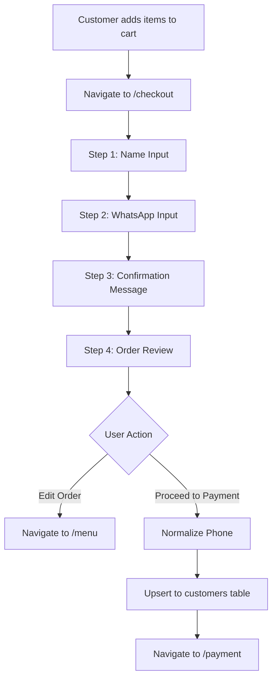

# Design Document

## Overview

The conversational checkout flow replaces the existing single-page checkout with a multi-step, animated experience that guides customers through providing their information in a friendly, conversational manner. The design preserves the legacy checkout at `/checkout2` while implementing the new flow at `/checkout`, ensuring backward compatibility during development and deployment.

## Architecture

### High-Level Flow



### Component Structure

```
src/pages/customer/
├── Checkout.tsx              (NEW - Conversational flow)
├── CheckoutLegacy.tsx        (RENAMED - Original checkout)
└── Payment.tsx               (Existing - No changes)

src/lib/
└── phoneUtils.ts             (ENHANCED - Add normalizePhone function)

src/components/
└── ui/                       (Existing - Reuse Button, Card, Input)
```

## Components and Interfaces

### Main Component: Checkout.tsx

**State Management:**

```typescript
type CheckoutStep = 'NAME' | 'WHATSAPP' | 'CONFIRM' | 'REVIEW';

interface CheckoutState {
  step: CheckoutStep;
  name: string;
  whatsapp: string;
  errors: {
    name?: string;
    whatsapp?: string;
  };
  isSubmitting: boolean;
}
```

**Key Hooks:**
- `useState<CheckoutStep>` - Track current step
- `useState<string>` - Store name and whatsapp inputs
- `useCart()` - Access cart items and total
- `useNavigate()` - Handle navigation
- `useEffect()` - Auto-advance from CONFIRM step

**Animation Strategy:**
- Use `framer-motion` library
- Wrap step content in `<motion.div>` with `AnimatePresence`
- Transition properties:
  - `initial`: `{ opacity: 0, x: 20 }`
  - `animate`: `{ opacity: 1, x: 0 }`
  - `exit`: `{ opacity: 0, x: -20 }`
  - `transition`: `{ duration: 0.3 }`

### Step Components

#### Step 1: Name Input (NAME)

**UI Elements:**
- Conversational prompt: "Olá! 👋 Para quem é o pedido?"
- Text input field with emoji icon (👤)
- "Continuar" button (disabled if name < 2 characters)

**Validation:**
- Minimum 2 characters
- Trim whitespace
- Display inline error message if invalid

**Behavior:**
- On "Continuar" click: validate → set step to 'WHATSAPP'

#### Step 2: WhatsApp Input (WHATSAPP)

**UI Elements:**
- Conversational prompt: "Legal, [Nome]! E qual o seu WhatsApp com DDD?"
- Tel input field with emoji icon (📱)
- Input mask: digits only, max 11 characters
- "Confirmar WhatsApp" button (disabled if invalid)

**Validation:**
- Exactly 11 digits (DDD + 9 digits)
- DDD range: 11-99
- Display inline error message if invalid

**Behavior:**
- On "Confirmar WhatsApp" click: validate → set step to 'CONFIRM'

#### Step 3: Confirmation (CONFIRM)

**UI Elements:**
- Success message: "Perfeito! Vamos te avisar sobre o pedido pelo WhatsApp. 👍"
- Animated checkmark or success icon
- No user interaction required

**Behavior:**
- Auto-advance after 1.5 seconds → set step to 'REVIEW'
- Use `setTimeout` in `useEffect` with cleanup

#### Step 4: Order Review (REVIEW)

**UI Elements:**
- Greeting: "Aqui está o seu pedido, [Nome]. Tudo certo?"
- Cart summary:
  - List of items with quantities and prices
  - Total amount (highlighted)
- Two action buttons:
  - "Editar Pedido" (secondary style)
  - "Ir para Pagamento" (primary style)

**Behavior:**
- "Editar Pedido": `navigate('/menu')`
- "Ir para Pagamento": Execute `handleGoToPayment()` function

## Data Models

### Customer Data Structure

```typescript
interface CustomerData {
  name: string;           // Customer name (2+ characters)
  whatsapp: string;       // Raw input (11 digits)
  normalizedPhone: string; // E.164 format (+5571987654321)
}
```

### Database Schema (Existing)

**Table: `customers`**
- `id`: UUID (primary key)
- `whatsapp`: VARCHAR(20) UNIQUE NOT NULL (E.164 format)
- `name`: VARCHAR(255) NOT NULL
- `first_order_date`: TIMESTAMP
- `last_order_date`: TIMESTAMP
- `total_orders`: INTEGER
- `total_spent`: DECIMAL(10,2)
- `created_at`: TIMESTAMP
- `updated_at`: TIMESTAMP

**Note:** The existing trigger `trigger_update_customer_stats` automatically updates customer records when orders are created. However, we want to capture customer data *before* order creation for marketing purposes, so we'll perform a manual upsert in the checkout flow.

## Phone Normalization Logic

### Function: `normalizePhone(rawPhone: string): string | null`

**Location:** `src/lib/phoneUtils.ts`

**Algorithm:**
1. Remove all non-digit characters: `rawPhone.replace(/\D/g, '')`
2. Validate length is exactly 11 digits
3. Validate DDD (first 2 digits) is between 11-99
4. Prepend country code: `+55${digits}`
5. Return normalized phone or `null` if invalid

**Example:**
- Input: `"71 98765-4321"` or `"71987654321"`
- Output: `"+5571987654321"`

**Error Cases:**
- Less than 11 digits → return `null`
- More than 11 digits → return `null`
- Invalid DDD → return `null`

## Data Persistence Strategy

### Customer Upsert Flow

**Function: `handleGoToPayment()`**

```typescript
const handleGoToPayment = async () => {
  try {
    setIsSubmitting(true);
    
    // 1. Normalize phone number
    const normalizedPhone = normalizePhone(whatsapp);
    if (!normalizedPhone) {
      toast.error("Número de WhatsApp inválido");
      return;
    }
    
    // 2. Upsert to customers table
    const { error } = await supabase
      .from('customers')
      .upsert({
        whatsapp: normalizedPhone,
        name: name.trim(),
        last_order_date: new Date().toISOString(),
      }, {
        onConflict: 'whatsapp'
      });
    
    if (error) {
      console.error('Customer upsert error:', error);
      toast.error("Erro ao salvar informações. Tente novamente.");
      return;
    }
    
    // 3. Store customer info in sessionStorage for Payment page
    sessionStorage.setItem('customerInfo', JSON.stringify({
      name: name.trim(),
      phone: normalizedPhone
    }));
    
    // 4. Navigate to payment
    navigate('/payment');
    
  } catch (error) {
    console.error('Unexpected error:', error);
    toast.error("Erro inesperado. Tente novamente.");
  } finally {
    setIsSubmitting(false);
  }
};
```

**Key Points:**
- Use `whatsapp` field (not `phone`) to match existing schema
- Upsert ensures existing customers are updated, new ones are created
- Store customer info in `sessionStorage` for Payment page access
- The Payment page will create the order with this customer info

### Integration with Existing Flow

**Current Flow:**
1. Checkout page collects customer info
2. Creates order in database
3. Navigates to `/payment/:orderId`

**New Flow:**
1. Conversational checkout collects customer info
2. Upserts customer to database
3. Stores customer info in sessionStorage
4. Navigates to `/payment` (no orderId yet)
5. Payment page creates order using sessionStorage data

**Note:** The Payment page needs to be updated to handle the case where no `orderId` is in the URL. It should:
- Check for `orderId` param
- If not present, create order using sessionStorage customer info
- Then proceed with payment flow

## Error Handling

### Validation Errors

**Name Validation:**
- Empty or whitespace only → "Nome é obrigatório"
- Less than 2 characters → "Nome deve ter pelo menos 2 caracteres"

**WhatsApp Validation:**
- Empty → "WhatsApp é obrigatório"
- Not 11 digits → "WhatsApp deve ter 11 dígitos (DDD + número)"
- Invalid DDD → "DDD inválido"

**Display Strategy:**
- Show error message below input field
- Red text color (`text-red-500`)
- Disable "Continue" button while error exists
- Clear error when user starts typing

### Database Errors

**Upsert Failure:**
- Log error to console
- Display toast: "Erro ao salvar informações. Tente novamente."
- Keep user on REVIEW step
- Allow retry

**Network Errors:**
- Catch in try-catch block
- Display toast: "Erro de conexão. Verifique sua internet."
- Keep user on REVIEW step
- Allow retry

### Edge Cases

**Empty Cart:**
- Check cart on component mount
- If empty, redirect to `/menu` immediately
- Display toast: "Carrinho vazio"

**Browser Back Button:**
- Allow navigation between steps
- Preserve entered data in state
- Don't clear data until order is created

**Session Timeout:**
- Cart data persists in localStorage (existing behavior)
- Customer info stored in component state (cleared on unmount)
- No special handling needed

## Testing Strategy

### Unit Tests

**Phone Normalization:**
- Test valid 11-digit numbers
- Test invalid lengths (10, 12 digits)
- Test invalid DDDs (00, 10, 100)
- Test with various formatting (spaces, dashes, parentheses)

**Validation Functions:**
- Test name validation edge cases
- Test WhatsApp validation edge cases
- Test error message generation

### Integration Tests

**Step Navigation:**
- Test forward navigation through all steps
- Test validation prevents advancement
- Test auto-advance from CONFIRM step
- Test "Edit Order" button navigation

**Data Persistence:**
- Test customer upsert with new customer
- Test customer upsert with existing customer (name update)
- Test sessionStorage persistence
- Test navigation to Payment page

### Manual Testing Checklist

1. **Legacy Checkout Preservation:**
   - Navigate to `/checkout2`
   - Verify original checkout works identically
   - Complete an order through legacy flow

2. **New Conversational Flow:**
   - Navigate to `/checkout`
   - Complete all 4 steps
   - Verify animations are smooth
   - Test validation on each step
   - Verify "Edit Order" button works
   - Complete order and verify customer data in Supabase

3. **Database Verification:**
   - After first order, check `customers` table in Supabase Studio
   - Verify phone is in E.164 format (+55...)
   - Submit second order with same phone, different name
   - Verify name is updated in database

4. **Error Scenarios:**
   - Test with invalid phone numbers
   - Test with network disconnected
   - Test with empty cart
   - Verify error messages display correctly

## Routing Changes

### App.tsx Updates

**Before:**
```typescript
<Route path="/checkout" element={
  <Suspense fallback={<LoadingFallback />}>
    <Checkout />
  </Suspense>
} />
```

**After:**
```typescript
// Legacy checkout
<Route path="/checkout2" element={
  <Suspense fallback={<LoadingFallback />}>
    <CheckoutLegacy />
  </Suspense>
} />

// New conversational checkout
<Route path="/checkout" element={
  <Suspense fallback={<LoadingFallback />}>
    <Checkout />
  </Suspense>
} />
```

**Import Changes:**
```typescript
// Add new import
const CheckoutLegacy = lazy(() => import("./pages/customer/CheckoutLegacy"));

// Existing Checkout import now points to new component
const Checkout = lazy(() => import("./pages/customer/Checkout"));
```

## UI/UX Design Patterns

### Visual Consistency

**Color Scheme:**
- Primary: Purple gradient (`from-purple-600 to-indigo-600`)
- Success: Green (`bg-green-500`)
- Error: Red (`text-red-500`)
- Background: Light gradient (`from-purple-50 via-blue-50 to-indigo-100`)

**Typography:**
- Prompts: `text-xl font-semibold`
- Input labels: `text-sm text-gray-600`
- Error messages: `text-sm text-red-500`

**Spacing:**
- Step container: `max-w-md mx-auto p-6`
- Input fields: `mb-4`
- Buttons: `mt-6`

### Responsive Design

**Mobile-First Approach:**
- Single column layout
- Large touch targets (min 44px height)
- Full-width buttons
- Adequate spacing between elements

**Desktop Enhancements:**
- Centered content with max-width constraint
- Larger font sizes
- More generous padding

### Accessibility

**Keyboard Navigation:**
- Tab order follows visual flow
- Enter key submits current step
- Escape key (optional) goes back one step

**Screen Readers:**
- Proper ARIA labels on inputs
- Error messages announced
- Step progress announced

**Visual Indicators:**
- Focus states on all interactive elements
- High contrast error messages
- Loading states during submission

## Performance Considerations

### Code Splitting

- Checkout component is already lazy-loaded
- framer-motion library (~50KB) will be loaded on-demand
- No impact on initial page load

### Animation Performance

- Use CSS transforms (translateX, opacity) for 60fps animations
- Avoid layout-triggering properties
- Use `will-change` hint for animated elements

### Database Optimization

- Upsert operation uses indexed `whatsapp` field
- Single database call per checkout
- No N+1 query issues

## Security Considerations

### Input Sanitization

- Phone numbers: Strip all non-digits before storage
- Names: Trim whitespace, no special sanitization needed
- No SQL injection risk (using Supabase client)

### Data Privacy

- Customer data stored with consent (implicit via checkout)
- Phone numbers used only for order notifications and marketing
- Comply with LGPD (Brazilian data protection law)

### Authentication

- No authentication required for customer checkout
- Supabase RLS policies allow INSERT/UPDATE on customers table
- Existing policies verified in migration file

## Migration Path

### Phase 1: File Refactoring
1. Rename `Checkout.tsx` to `CheckoutLegacy.tsx`
2. Update imports in `App.tsx`
3. Add `/checkout2` route
4. Verify legacy checkout works

### Phase 2: New Component Development
1. Create new `Checkout.tsx` with step structure
2. Implement NAME and WHATSAPP steps
3. Implement CONFIRM step with auto-advance
4. Implement REVIEW step with cart summary

### Phase 3: Integration
1. Add `normalizePhone` function to `phoneUtils.ts`
2. Implement `handleGoToPayment` with upsert logic
3. Connect navigation and error handling
4. Add animations with framer-motion

### Phase 4: Testing & Deployment
1. Test all steps and validations
2. Verify database upserts
3. Test legacy checkout still works
4. Deploy to production
5. Monitor for errors

### Rollback Plan

If issues arise:
1. Update `/checkout` route to point to `CheckoutLegacy`
2. Keep new `Checkout.tsx` in codebase for fixes
3. Redeploy after fixes
4. No database rollback needed (upserts are safe)
