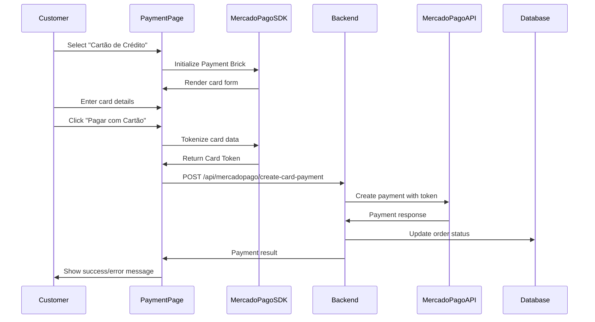

# Design Document: Credit Card Payments with MercadoPago

## Overview

This design document outlines the technical approach for integrating credit card payments into the existing Coco Loko Açaiteria checkout flow. The solution will leverage MercadoPago's Payment Brick (Checkout Transparente) to provide a secure, embedded credit card payment form alongside the existing PIX payment option.

### Key Design Principles

- **Security First**: Card data never touches our servers - tokenization happens client-side
- **Progressive Enhancement**: Add credit card support without disrupting existing PIX flow
- **User Experience**: Seamless payment method switching with clear visual feedback
- **Error Resilience**: Comprehensive error handling with user-friendly messages
- **Mobile-First**: Optimized for beach-side mobile ordering experience

## Architecture

### High-Level Flow



### Component Architecture

The implementation will follow the existing project structure:

- **Frontend**: React components in `src/pages/customer/Payment.tsx`
- **UI Components**: Reusable components in `src/components/`
- **Integration Layer**: MercadoPago client in `src/integrations/mercadopago/`
- **Backend**: Supabase Edge Function in `supabase/functions/`
- **Database**: PostgreSQL via Supabase

## Components and Interfaces

### 1. Frontend Components

#### Payment Page Enhancement (`src/pages/customer/Payment.tsx`)

**Current State**: Displays PIX payment only
**Enhancement**: Add payment method selector and credit card interface

**New State Management**:
```typescript
type PaymentMethod = 'pix' | 'credit_card';

interface PaymentPageState {
  selectedMethod: PaymentMethod;
  paymentStatus: 'pending' | 'approved' | 'rejected' | 'in_process';
  isProcessing: boolean;
  errorMessage: string | null;
}
```

**Key Responsibilities**:
- Render payment method selector (PIX / Cartão de Crédito)
- Conditionally display PIX or credit card interface
- Manage payment submission flow
- Handle payment status updates
- Display error messages and success states

#### Payment Method Selector Component

**New Component**: `src/components/PaymentMethodSelector.tsx`

```typescript
interface PaymentMethodSelectorProps {
  selectedMethod: PaymentMethod;
  onMethodChange: (method: PaymentMethod) => void;
  disabled?: boolean;
}
```

**Features**:
- Radio button or tab-style selector
- Visual indicators for selected method
- Disabled state during payment processing
- Accessible keyboard navigation

#### Credit Card Payment Component

**New Component**: `src/components/CreditCardPayment.tsx`

```typescript
interface CreditCardPaymentProps {
  orderId: string;
  amount: number;
  onPaymentSuccess: (paymentId: string) => void;
  onPaymentError: (error: string) => void;
  onPaymentPending: () => void;
}
```

**Features**:
- Initialize MercadoPago Payment Brick
- Handle tokenization
- Submit payment to backend
- Display loading states
- Show validation errors from Payment Brick

### 2. MercadoPago SDK Integration

#### Script Loading

**Location**: `index.html` or dynamic loading in Payment page

```html
<script src="https://sdk.mercadopago.com/js/v2"></script>
```

**Environment Configuration**:
```typescript
// src/integrations/mercadopago/config.ts
export const MERCADOPAGO_PUBLIC_KEY = import.meta.env.VITE_MERCADOPAGO_PUBLIC_KEY;
```

#### Payment Brick Initialization

**New Service**: `src/integrations/mercadopago/payment-brick.ts`

```typescript
interface PaymentBrickConfig {
  containerId: string;
  publicKey: string;
  amount: number;
  locale: 'pt-BR';
  customization: {
    visual: {
      hidePaymentButton: boolean;
    };
    paymentMethods: {
      maxInstallments: 1; // No installments
    };
  };
}

class PaymentBrickService {
  private mp: any;
  private brickController: any;

  async initialize(config: PaymentBrickConfig): Promise<void>;
  async getCardToken(): Promise<string>;
  async unmount(): Promise<void>;
}
```

### 3. Backend Integration

#### New Edge Function: `create-card-payment`

**Location**: `supabase/functions/mercadopago-card-payment/index.ts`

**Request Interface**:
```typescript
interface CardPaymentRequest {
  orderId: string;
  token: string; // Card token from MercadoPago.js
  amount: number;
  paymentMethodId: string; // e.g., 'visa', 'master'
  payer: {
    email: string;
    identification: {
      type: string; // 'CPF'
      number: string;
    };
  };
}
```

**Response Interface**:
```typescript
interface CardPaymentResponse {
  success: boolean;
  paymentId?: string;
  status: 'approved' | 'rejected' | 'in_process';
  statusDetail?: string;
  error?: string;
}
```

**Key Responsibilities**:
- Validate request data
- Call MercadoPago Payments API with card token
- Update order status in database
- Return payment result to frontend
- Handle MercadoPago API errors

**MercadoPago API Call**:
```typescript
POST https://api.mercadopago.com/v1/payments
Headers:
  Authorization: Bearer ACCESS_TOKEN
  Content-Type: application/json

Body:
{
  transaction_amount: number,
  token: string,
  description: string,
  installments: 1,
  payment_method_id: string,
  payer: {
    email: string,
    identification: {
      type: string,
      number: string
    }
  },
  metadata: {
    order_id: string
  },
  external_reference: string
}
```

#### Enhanced Webhook Handler

**Location**: `supabase/functions/mercadopago-webhook/index.ts`

**Enhancement**: Already handles payment status updates, no changes needed for credit card payments. The webhook will process both PIX and credit card payment notifications identically.

### 4. Integration Layer Updates

#### MercadoPago Client Enhancement

**Location**: `src/integrations/mercadopago/client.ts`

**New Method**:
```typescript
class MercadoPagoService {
  // Existing methods...
  
  async createCardPayment(request: CardPaymentRequest): Promise<CardPaymentResponse> {
    return this.retryWithBackoff(async () => {
      const response = await fetch('/api/mercadopago/create-card-payment', {
        method: 'POST',
        headers: { 'Content-Type': 'application/json' },
        body: JSON.stringify(request)
      });
      
      if (!response.ok) {
        const errorData = await response.json();
        throw new Error(errorData.error || 'Payment failed');
      }
      
      return response.json();
    }, 'Create card payment');
  }
}
```

#### Type Definitions

**Location**: `src/integrations/mercadopago/types.ts`

**New Types**:
```typescript
export interface CardPaymentRequest {
  orderId: string;
  token: string;
  amount: number;
  paymentMethodId: string;
  payer: {
    email: string;
    identification: {
      type: 'CPF' | 'CNPJ';
      number: string;
    };
  };
}

export interface CardPaymentResponse {
  success: boolean;
  paymentId?: string;
  status: 'approved' | 'rejected' | 'in_process';
  statusDetail?: string;
  error?: string;
}

export type PaymentMethod = 'pix' | 'credit_card';
```

## Data Models

### Database Schema

#### Orders Table (Existing)

No schema changes required. The existing columns support both PIX and credit card payments:

```sql
-- Existing columns that support both payment methods
orders (
  id uuid PRIMARY KEY,
  order_number integer,
  customer_name text,
  customer_phone text,
  table_number text,
  total_amount numeric,
  status text, -- 'pending_payment', 'paid', 'cancelled', etc.
  mercadopago_payment_id text, -- Works for both PIX and card
  payment_confirmed_at timestamp,
  created_at timestamp,
  updated_at timestamp,
  
  -- PIX-specific (optional for card payments)
  qr_code_data text,
  pix_copy_paste text,
  payment_expires_at timestamp
)
```

**Status Flow**:
- `pending_payment` → Initial state for both methods
- `paid` → Payment approved (PIX or card)
- `cancelled` → Payment rejected or cancelled
- `in_process` → Payment under review (rare for PIX, possible for cards)

#### Payment Webhooks Table (Existing)

Already supports both payment types - no changes needed:

```sql
payment_webhooks (
  id uuid PRIMARY KEY,
  order_id uuid REFERENCES orders(id),
  mercadopago_payment_id text,
  webhook_type text,
  webhook_action text,
  payment_status text,
  webhook_data jsonb,
  payment_data jsonb,
  processed_at timestamp
)
```

### Frontend State Models

#### Payment Page State

```typescript
interface PaymentPageState {
  order: Order | null;
  selectedPaymentMethod: 'pix' | 'credit_card';
  
  // PIX-specific state
  pixPaymentData: MercadoPagoPaymentResponse | null;
  
  // Credit card-specific state
  cardPaymentProcessing: boolean;
  cardPaymentError: string | null;
  
  // Common state
  paymentStatus: 'pending' | 'approved' | 'rejected' | 'in_process' | 'expired' | 'error';
  loading: boolean;
}
```

## Error Handling

### Frontend Error Scenarios

#### 1. Payment Brick Initialization Failure

**Cause**: Invalid public key, network error, or SDK load failure
**Handling**:
- Display error message: "Erro ao carregar formulário de pagamento"
- Offer fallback to PIX payment
- Log error for monitoring

#### 2. Card Tokenization Failure

**Cause**: Invalid card data, expired card, or network error
**Handling**:
- Display specific error from Payment Brick (e.g., "Número de cartão inválido")
- Keep form visible for correction
- Re-enable submit button

#### 3. Payment Processing Failure

**Cause**: Backend error, MercadoPago API error, or network timeout
**Handling**:
- Display user-friendly error message
- Offer retry option
- Log error details
- Fallback to PIX if multiple failures

### Backend Error Scenarios

#### 1. Invalid Token

**Cause**: Expired or malformed card token
**Response**:
```json
{
  "success": false,
  "error": "Token inválido ou expirado. Tente novamente."
}
```

#### 2. Payment Rejected by MercadoPago

**Cause**: Insufficient funds, card blocked, or fraud detection
**Response**:
```json
{
  "success": false,
  "status": "rejected",
  "statusDetail": "cc_rejected_insufficient_amount",
  "error": "Fundos insuficientes"
}
```

**Status Detail Mapping**:
- `cc_rejected_insufficient_amount` → "Fundos insuficientes"
- `cc_rejected_bad_filled_card_number` → "Número de cartão inválido"
- `cc_rejected_bad_filled_date` → "Data de validade inválida"
- `cc_rejected_bad_filled_security_code` → "Código de segurança inválido"
- `cc_rejected_call_for_authorize` → "Entre em contato com seu banco"
- `cc_rejected_card_disabled` → "Cartão desabilitado"
- `cc_rejected_duplicated_payment` → "Pagamento duplicado"
- `cc_rejected_high_risk` → "Pagamento recusado por segurança"

#### 3. MercadoPago API Timeout

**Cause**: Network issues or API downtime
**Handling**:
- Retry with exponential backoff (existing retry logic)
- Return timeout error after max retries
- Suggest customer try again later

### Error Message Localization

All error messages will be in Portuguese (pt-BR) for the Brazilian market:

```typescript
const ERROR_MESSAGES = {
  CARD_FORM_LOAD_ERROR: 'Erro ao carregar formulário de pagamento',
  TOKENIZATION_ERROR: 'Erro ao processar dados do cartão',
  PAYMENT_PROCESSING_ERROR: 'Erro ao processar pagamento',
  NETWORK_ERROR: 'Erro de conexão. Verifique sua internet.',
  GENERIC_ERROR: 'Erro inesperado. Tente novamente.',
  
  // MercadoPago specific
  INSUFFICIENT_FUNDS: 'Fundos insuficientes',
  INVALID_CARD: 'Cartão inválido',
  CARD_DISABLED: 'Cartão desabilitado',
  CONTACT_BANK: 'Entre em contato com seu banco',
  HIGH_RISK: 'Pagamento recusado por segurança'
};
```

## Testing Strategy

### Unit Tests

#### Frontend Components

**Test File**: `src/components/__tests__/CreditCardPayment.test.tsx`

**Test Cases**:
- Payment Brick initialization with correct config
- Card token generation on submit
- Error handling for tokenization failures
- Loading state management
- Success callback invocation
- Error callback invocation

**Test File**: `src/components/__tests__/PaymentMethodSelector.test.tsx`

**Test Cases**:
- Method selection changes state
- Disabled state prevents interaction
- Keyboard navigation works
- Accessibility attributes present

#### Integration Layer

**Test File**: `src/integrations/mercadopago/__tests__/client.test.ts`

**Test Cases**:
- `createCardPayment` sends correct request format
- Retry logic works for network errors
- Error messages are user-friendly
- Request validation catches invalid data

### Integration Tests

#### Payment Flow

**Test File**: `src/pages/customer/__tests__/Payment.integration.test.tsx`

**Test Cases**:
- Switch from PIX to credit card method
- Submit card payment successfully
- Handle payment rejection
- Handle payment pending status
- Display appropriate error messages
- Retry failed payments

### End-to-End Tests

#### Complete Payment Journey

**Scenarios**:
1. **Successful Card Payment**
   - Navigate to payment page
   - Select credit card method
   - Fill card details
   - Submit payment
   - Verify success message
   - Verify order status updated

2. **Card Payment Rejection**
   - Navigate to payment page
   - Select credit card method
   - Fill card details (test card for rejection)
   - Submit payment
   - Verify error message displayed
   - Verify retry option available

3. **Switch Between Payment Methods**
   - Navigate to payment page
   - Select credit card method
   - Switch back to PIX
   - Verify PIX interface displayed
   - Switch to credit card again
   - Verify card form re-initialized

### Manual Testing Checklist

- [ ] Payment Brick loads correctly on mobile devices
- [ ] Card form is responsive and usable on small screens
- [ ] Payment method switching is smooth
- [ ] Error messages are clear and helpful
- [ ] Success flow redirects appropriately
- [ ] Order summary remains visible during payment
- [ ] Loading states provide feedback
- [ ] Retry mechanism works after failures
- [ ] Webhook updates order status correctly
- [ ] Multiple payment attempts don't create duplicate charges

### Test Cards (MercadoPago Sandbox)

For testing in sandbox environment:

**Approved Payment**:
- Card: 5031 4332 1540 6351
- CVV: 123
- Expiry: 11/25

**Rejected Payment (Insufficient Funds)**:
- Card: 5031 4332 1540 6351
- CVV: 123
- Expiry: 11/25
- Amount: Use specific test amounts per MercadoPago docs

**Pending Payment**:
- Card: 5031 4332 1540 6351
- CVV: 123
- Expiry: 11/25
- Amount: Use specific test amounts per MercadoPago docs

## Security Considerations

### PCI Compliance

- **No Card Data Storage**: Card numbers, CVV, and expiration dates never touch our servers
- **Tokenization**: All sensitive data is tokenized by MercadoPago SDK client-side
- **HTTPS Only**: All communication over secure connections
- **Token Single-Use**: Card tokens are one-time use only

### API Security

- **Access Token Protection**: MercadoPago access token stored as environment variable
- **Server-Side Validation**: All payment requests validated on backend
- **Webhook Signature Verification**: Validate webhook authenticity (already implemented)
- **Rate Limiting**: Prevent abuse of payment endpoints

### Data Privacy

- **Minimal Data Collection**: Only collect necessary payer information
- **CPF Handling**: Customer document numbers handled securely
- **Audit Trail**: Payment webhooks table logs all payment events

## Performance Considerations

### Frontend Optimization

- **Lazy Load Payment Brick**: Only load MercadoPago SDK when credit card method selected
- **Debounce Form Validation**: Avoid excessive validation calls
- **Optimistic UI Updates**: Show loading states immediately on submit

### Backend Optimization

- **Connection Pooling**: Reuse HTTP connections to MercadoPago API
- **Timeout Configuration**: Set appropriate timeouts (30s for payment creation)
- **Retry Logic**: Exponential backoff for transient failures (already implemented)

### Monitoring

- **Payment Success Rate**: Track approval vs rejection rates
- **Error Rates**: Monitor tokenization and payment processing errors
- **Response Times**: Track API call latency
- **Webhook Processing**: Monitor webhook delivery and processing times

## Deployment Considerations

### Environment Variables

**Frontend** (`.env`):
```
VITE_MERCADOPAGO_PUBLIC_KEY=your_public_key_here
```

**Backend** (Supabase Edge Function secrets):
```
MERCADOPAGO_ACCESS_TOKEN=your_access_token_here
```

### Rollout Strategy

1. **Phase 1**: Deploy backend edge function
2. **Phase 2**: Deploy frontend with feature flag (disabled)
3. **Phase 3**: Enable for internal testing
4. **Phase 4**: Enable for 10% of users (A/B test)
5. **Phase 5**: Full rollout if metrics are positive

### Rollback Plan

- Feature flag to disable credit card option
- Revert to PIX-only if critical issues arise
- Database schema unchanged, so no migration rollback needed

## Future Enhancements

### Potential Improvements (Out of Scope)

- **Installment Payments**: Add support for parcelamento (2x, 3x, etc.)
- **Saved Cards**: Allow customers to save cards for future purchases
- **Debit Cards**: Support debit card payments
- **Other Payment Methods**: Boleto, bank transfer, etc.
- **Payment Analytics**: Dashboard for payment method preferences
- **Fraud Detection**: Additional fraud prevention measures
- **3D Secure**: Enhanced security for high-value transactions

## Dependencies

### External Services

- **MercadoPago SDK**: v2 (latest)
- **MercadoPago Payments API**: v1

### Internal Dependencies

- Existing PIX payment flow (no changes)
- Existing webhook handler (no changes)
- Existing order management system (no changes)
- Existing database schema (no changes)

### NPM Packages

No new packages required - MercadoPago SDK loaded via CDN.

## Migration Path

No database migrations required. The existing schema supports both PIX and credit card payments through the same columns.

## Documentation Updates

### User-Facing

- Update payment instructions to include credit card option
- Add FAQ about credit card payments
- Update screenshots in help documentation

### Developer-Facing

- Document Payment Brick integration
- Document new edge function API
- Update architecture diagrams
- Add troubleshooting guide for common issues

## Success Metrics

### Key Performance Indicators

- **Payment Success Rate**: Target >90% approval rate for valid cards
- **Conversion Rate**: Measure increase in completed orders
- **Error Rate**: Target <5% payment processing errors
- **User Satisfaction**: Monitor customer feedback
- **Payment Method Split**: Track PIX vs credit card usage

### Monitoring Dashboards

- Real-time payment status monitoring
- Error rate alerts
- Payment method distribution
- Average payment processing time
