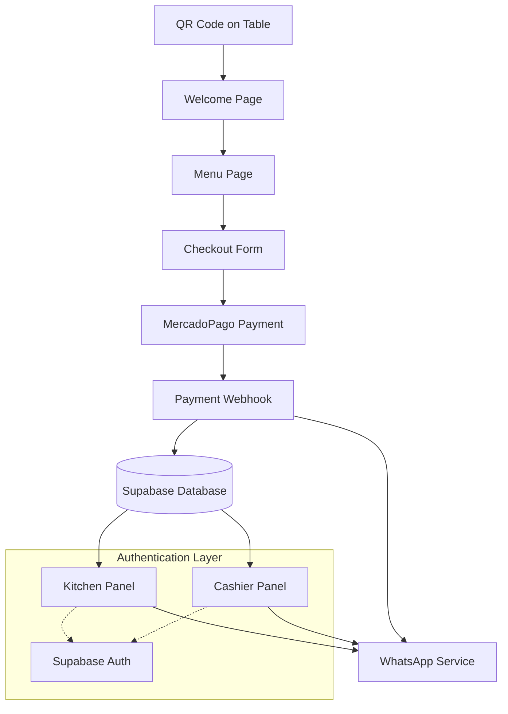

# Design Document

## Overview

The customer order flow system is built on the existing React/Vite/Supabase architecture and extends it with MercadoPago payment integration and WhatsApp notification services. The system provides a seamless mobile-first experience for customers to scan QR codes, place orders, make payments, and receive notifications, while providing real-time dashboards for kitchen and cashier staff.

## Architecture

### High-Level Architecture



### Technology Stack

- **Frontend**: React 18 + TypeScript + Vite
- **UI Components**: Radix UI + Tailwind CSS + shadcn/ui
- **State Management**: TanStack Query for server state
- **Database**: Supabase (PostgreSQL)
- **Authentication**: Supabase Auth
- **Payment Processing**: MercadoPago API
- **Notifications**: WhatsApp Business API
- **Routing**: React Router DOM

## Components and Interfaces

### 1. Customer-Facing Components

#### QR Code Landing Component
- **Purpose**: Handle QR code scans and extract table information
- **Route**: `/:tableId` or `/table/:tableId`
- **Props**: `tableId: string`
- **State**: Table validation, loading state
- **Navigation**: Redirects to Welcome page with table context

#### Welcome Page Component
- **Purpose**: Greet customers and provide ordering interface entry
- **Route**: `/welcome/:tableId`
- **Props**: `tableId: string`
- **Features**: 
  - Display table number
  - Restaurant branding
  - "Start Ordering" CTA button
- **Navigation**: Proceeds to Menu page

#### Enhanced Menu Component
- **Purpose**: Display categorized menu items with cart functionality
- **Route**: `/menu/:tableId`
- **State Management**:
  ```typescript
  interface CartItem {
    menuItemId: string;
    name: string;
    price: number;
    quantity: number;
  }
  
  interface CartState {
    items: CartItem[];
    tableId: string;
    total: number;
  }
  ```
- **Features**:
  - Category-based menu display
  - Add/remove items from cart
  - Quantity adjustment
  - Running total calculation
  - Proceed to checkout

#### Customer Information Component
- **Purpose**: Collect customer details for order and notifications
- **Route**: `/checkout/:tableId`
- **Form Schema**:
  ```typescript
  interface CustomerForm {
    name: string;
    whatsapp: string; // Format: +55XXXXXXXXXXX
    tableId: string;
    cartItems: CartItem[];
  }
  ```
- **Validation**: 
  - Required name (min 2 characters)
  - Valid WhatsApp format with Brazilian country code
  - Non-empty cart validation

#### Payment Component
- **Purpose**: Display MercadoPago payment interface
- **Features**:
  - QR code display
  - Copy/paste Pix code
  - Payment status polling
  - Order confirmation display

### 2. Staff Panel Components

#### Kitchen Panel Component
- **Route**: `/kitchen` (protected)
- **Authentication**: Supabase Auth with 'kitchen' role
- **Features**:
  - Real-time order display (paid orders only)
  - Order status management (in preparation, ready)
  - Order details view (items, table, customer)
  - Audio/visual notifications for new orders

#### Cashier Panel Component
- **Route**: `/cashier` (protected)
- **Authentication**: Supabase Auth with 'cashier' role
- **Features**:
  - All orders view (pending payment, paid, ready, completed)
  - Payment status monitoring
  - Manual order status updates
  - Customer notification triggers
  - Order history and reporting

### 3. Service Layer Components

#### MercadoPago Service
```typescript
interface MercadoPagoService {
  createPayment(order: OrderData): Promise<PaymentResponse>;
  checkPaymentStatus(paymentId: string): Promise<PaymentStatus>;
  handleWebhook(webhookData: any): Promise<void>;
}

interface PaymentResponse {
  id: string;
  qrCode: string;
  qrCodeBase64: string;
  pixCopyPaste: string;
  expirationDate: string;
}
```

#### WhatsApp Service
```typescript
interface WhatsAppService {
  sendOrderConfirmation(phone: string, orderData: OrderData): Promise<void>;
  sendReadyNotification(phone: string, orderData: OrderData): Promise<void>;
  sendStatusUpdate(phone: string, status: string, orderData: OrderData): Promise<void>;
}
```

#### Real-time Service
```typescript
interface RealtimeService {
  subscribeToOrders(callback: (order: Order) => void): () => void;
  subscribeToOrderUpdates(orderId: string, callback: (order: Order) => void): () => void;
  notifyNewOrder(order: Order): Promise<void>;
}
```

## Data Models

### Enhanced Database Schema

The existing Supabase schema will be extended with additional fields and tables:

#### Orders Table (Enhanced)
```sql
-- Add new columns to existing orders table
ALTER TABLE orders ADD COLUMN IF NOT EXISTS mercadopago_payment_id VARCHAR;
ALTER TABLE orders ADD COLUMN IF NOT EXISTS qr_code_data TEXT;
ALTER TABLE orders ADD COLUMN IF NOT EXISTS pix_copy_paste TEXT;
ALTER TABLE orders ADD COLUMN IF NOT EXISTS payment_expires_at TIMESTAMP;
ALTER TABLE orders ADD COLUMN IF NOT EXISTS kitchen_notified_at TIMESTAMP;
```

#### Payment Webhooks Table (New)
```sql
CREATE TABLE payment_webhooks (
  id UUID PRIMARY KEY DEFAULT gen_random_uuid(),
  order_id UUID REFERENCES orders(id),
  webhook_data JSONB,
  processed_at TIMESTAMP,
  created_at TIMESTAMP DEFAULT NOW()
);
```

#### WhatsApp Notifications Table (New)
```sql
CREATE TABLE whatsapp_notifications (
  id UUID PRIMARY KEY DEFAULT gen_random_uuid(),
  order_id UUID REFERENCES orders(id),
  phone VARCHAR NOT NULL,
  message_type VARCHAR NOT NULL, -- 'confirmation', 'ready', 'status_update'
  message_content TEXT,
  sent_at TIMESTAMP,
  status VARCHAR DEFAULT 'pending', -- 'pending', 'sent', 'failed'
  created_at TIMESTAMP DEFAULT NOW()
);
```

### TypeScript Interfaces

```typescript
interface Order {
  id: string;
  orderNumber: number;
  tableNumber: string;
  customerName: string;
  customerPhone: string;
  totalAmount: number;
  status: 'pending_payment' | 'paid' | 'in_preparation' | 'ready' | 'completed';
  mercadopagoPaymentId?: string;
  qrCodeData?: string;
  pixCopyPaste?: string;
  paymentExpiresAt?: string;
  createdAt: string;
  paymentConfirmedAt?: string;
  kitchenNotifiedAt?: string;
  readyAt?: string;
  items: OrderItem[];
}

interface OrderItem {
  id: string;
  menuItemId: string;
  itemName: string;
  quantity: number;
  unitPrice: number;
}

interface PaymentWebhook {
  id: string;
  orderId: string;
  webhookData: any;
  processedAt?: string;
  createdAt: string;
}
```

## Error Handling

### Payment Processing Errors
1. **MercadoPago API Failures**:
   - Retry mechanism with exponential backoff
   - Fallback to manual payment entry
   - User-friendly error messages
   - Admin notification system

2. **Webhook Processing Errors**:
   - Idempotency handling for duplicate webhooks
   - Dead letter queue for failed webhook processing
   - Manual payment verification interface

3. **Payment Timeout Handling**:
   - Automatic order expiration after 15 minutes
   - Customer notification of expired orders
   - Inventory release for expired orders

### WhatsApp Integration Errors
1. **Message Delivery Failures**:
   - Retry mechanism with different intervals
   - Fallback notification methods
   - Status tracking and reporting

2. **Invalid Phone Numbers**:
   - Phone number validation and formatting
   - Error feedback to customer
   - Manual contact options

### Database and Network Errors
1. **Supabase Connection Issues**:
   - Connection retry logic
   - Offline state handling
   - Local storage fallback for cart data

2. **Real-time Subscription Failures**:
   - Automatic reconnection
   - Polling fallback mechanism
   - Connection status indicators

## Testing Strategy

### Unit Testing
- **Payment Service**: Mock MercadoPago API responses
- **WhatsApp Service**: Mock message sending functionality
- **Cart Logic**: Test cart calculations and state management
- **Form Validation**: Test customer information validation

### Integration Testing
- **Payment Flow**: End-to-end payment processing with MercadoPago sandbox
- **Webhook Processing**: Test webhook reception and order status updates
- **Database Operations**: Test order creation and status updates
- **Authentication**: Test role-based access to kitchen/cashier panels

### End-to-End Testing
- **Customer Journey**: Complete flow from QR scan to order completion
- **Staff Workflows**: Kitchen and cashier panel functionality
- **Real-time Updates**: Test real-time order updates across panels
- **Error Scenarios**: Test payment failures and recovery

### Performance Testing
- **Load Testing**: Simulate multiple concurrent orders
- **Database Performance**: Test query performance with large datasets
- **Real-time Performance**: Test WebSocket connection limits
- **Mobile Performance**: Test on various mobile devices and connections

## Security Considerations

### Payment Security
- **PCI Compliance**: No storage of payment card data
- **API Key Management**: Secure storage of MercadoPago credentials
- **Webhook Validation**: Verify webhook authenticity
- **HTTPS Enforcement**: All payment-related communications over HTTPS

### Authentication Security
- **Role-Based Access**: Strict role enforcement for staff panels
- **Session Management**: Secure session handling with Supabase Auth
- **Password Policies**: Strong password requirements for staff accounts
- **Multi-Factor Authentication**: Optional MFA for admin accounts

### Data Protection
- **Customer Data**: Minimal data collection and secure storage
- **Phone Number Encryption**: Encrypt WhatsApp phone numbers
- **Audit Logging**: Log all order status changes and access attempts
- **Data Retention**: Automatic cleanup of old order data

## Performance Optimization

### Frontend Optimization
- **Code Splitting**: Lazy load staff panels and non-critical components
- **Image Optimization**: Optimize menu item images
- **Caching Strategy**: Cache menu data and static assets
- **Bundle Size**: Minimize JavaScript bundle size

### Database Optimization
- **Indexing**: Proper indexes on frequently queried columns
- **Query Optimization**: Efficient queries for order retrieval
- **Connection Pooling**: Optimize database connection usage
- **Real-time Subscriptions**: Efficient subscription management

### API Integration Optimization
- **Request Batching**: Batch WhatsApp notifications when possible
- **Caching**: Cache MercadoPago payment status responses
- **Rate Limiting**: Respect API rate limits with proper queuing
- **Connection Reuse**: Reuse HTTP connections for API calls

## Deployment and Infrastructure

### Environment Configuration
- **Development**: Local Supabase instance with MercadoPago sandbox
- **Staging**: Supabase staging with MercadoPago sandbox
- **Production**: Supabase production with MercadoPago production API

### Environment Variables
```bash
# Supabase
VITE_SUPABASE_URL=
VITE_SUPABASE_PUBLISHABLE_KEY=

# MercadoPago
VITE_MERCADOPAGO_PUBLIC_KEY=
MERCADOPAGO_ACCESS_TOKEN=
MERCADOPAGO_WEBHOOK_SECRET=

# WhatsApp
WHATSAPP_API_TOKEN=
WHATSAPP_PHONE_NUMBER_ID=

# Application
VITE_APP_URL=
WEBHOOK_BASE_URL=
```

### Monitoring and Logging
- **Error Tracking**: Implement error tracking for payment failures
- **Performance Monitoring**: Monitor API response times
- **Business Metrics**: Track order completion rates and payment success
- **Alert System**: Alerts for critical failures and high error rates