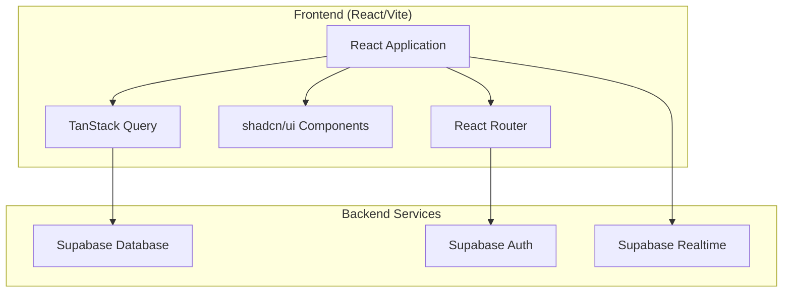
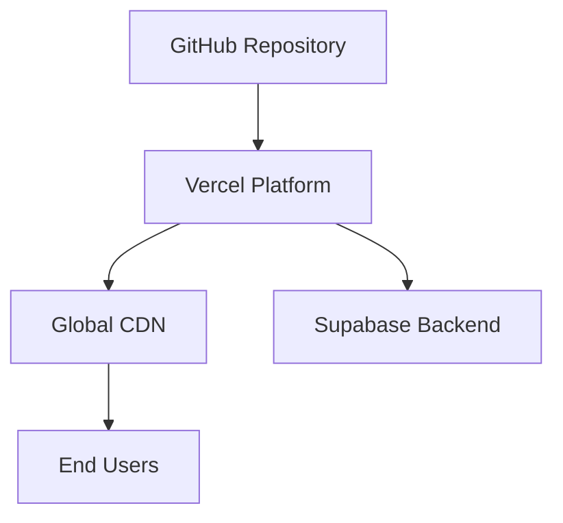
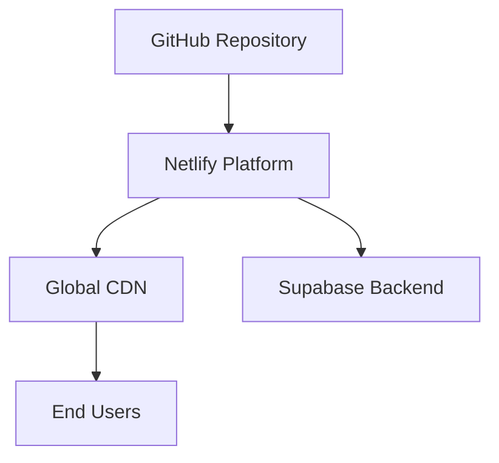
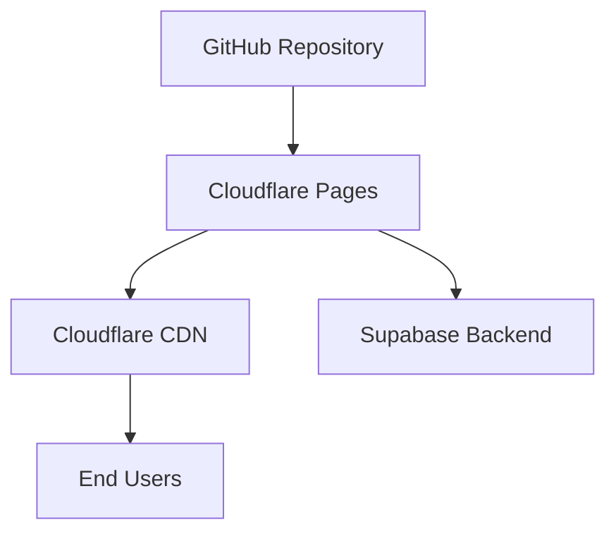

# Design Document

## Overview

The deployment fix design addresses the critical blocker preventing praia-pix-order from being deployed to production. Analysis reveals this is a React/Vite/Supabase application that needs static hosting deployment, not Cloudflare Workers. The design provides multiple deployment options and a systematic approach to diagnose and resolve deployment issues while ensuring the complete customer journey works end-to-end.

## Architecture

### Current Application Architecture



### Deployment Architecture Options

#### Option 1: Vercel (Recommended)


#### Option 2: Netlify


#### Option 3: Cloudflare Pages


## Components and Interfaces

### 1. Deployment Configuration Components

#### Build Configuration
- **Purpose**: Ensure proper build output for static hosting
- **Files**: `vite.config.ts`, `package.json`
- **Requirements**: 
  - Correct build command configuration
  - Proper asset handling
  - Environment variable configuration

#### Environment Configuration
- **Purpose**: Manage environment variables across deployment stages
- **Files**: `.env`, `.env.production`, `.env.local`
- **Security**: Ensure only VITE_ prefixed variables are exposed to client

#### Routing Configuration
- **Purpose**: Handle client-side routing in production
- **Implementation**: SPA fallback configuration
- **Files**: `_redirects` (Netlify), `vercel.json` (Vercel), `_routes.json` (Cloudflare Pages)

### 2. Deployment Verification Components

#### Health Check Endpoint
```typescript
interface HealthCheck {
  status: 'healthy' | 'unhealthy';
  timestamp: string;
  services: {
    supabase: 'connected' | 'disconnected';
    database: 'accessible' | 'inaccessible';
    auth: 'functional' | 'non-functional';
  };
}
```

#### Deployment Verification Service
```typescript
interface DeploymentVerification {
  verifyStaticAssets(): Promise<boolean>;
  verifySupabaseConnection(): Promise<boolean>;
  verifyRouting(): Promise<boolean>;
  verifyAuthentication(): Promise<boolean>;
  runFullHealthCheck(): Promise<HealthCheck>;
}
```

### 3. Customer Journey Verification Components

#### Journey Test Service
```typescript
interface CustomerJourneyTest {
  testQRCodeLanding(): Promise<boolean>;
  testMenuNavigation(): Promise<boolean>;
  testCartFunctionality(): Promise<boolean>;
  testCheckoutForm(): Promise<boolean>;
  testDatabaseOperations(): Promise<boolean>;
  runCompleteJourney(): Promise<JourneyTestResult>;
}

interface JourneyTestResult {
  success: boolean;
  completedSteps: string[];
  failedSteps: string[];
  errors: Error[];
}
```

## Data Models

### Deployment Configuration

#### Environment Variables Schema
```typescript
interface EnvironmentConfig {
  // Supabase Configuration
  VITE_SUPABASE_URL: string;
  VITE_SUPABASE_PUBLISHABLE_KEY: string;
  
  // Application Configuration
  VITE_APP_URL?: string;
  VITE_APP_NAME?: string;
  
  // Future Integrations (for Phase 2)
  VITE_MERCADOPAGO_PUBLIC_KEY?: string;
  WHATSAPP_API_TOKEN?: string; // Server-side only
}
```

#### Build Configuration Schema
```typescript
interface BuildConfig {
  outputDir: string;
  assetsDir: string;
  sourcemap: boolean;
  minify: boolean;
  target: string[];
}
```

### Deployment Status Tracking

#### Deployment Log Schema
```typescript
interface DeploymentLog {
  id: string;
  timestamp: string;
  stage: 'build' | 'deploy' | 'verify' | 'complete' | 'failed';
  status: 'success' | 'error' | 'in_progress';
  message: string;
  details?: any;
  duration?: number;
}
```

## Error Handling

### Build Errors
1. **TypeScript Compilation Errors**:
   - Strict type checking enforcement
   - Missing type definitions resolution
   - Import/export error resolution

2. **Asset Loading Errors**:
   - Missing asset file handling
   - Incorrect asset path resolution
   - Large asset optimization

3. **Environment Variable Errors**:
   - Missing required variables detection
   - Invalid variable format validation
   - Security exposure prevention

### Deployment Errors
1. **Platform-Specific Errors**:
   - Build timeout handling
   - Memory limit exceeded resolution
   - Platform configuration errors

2. **Network and DNS Errors**:
   - Domain configuration issues
   - SSL certificate problems
   - CDN propagation delays

3. **Service Integration Errors**:
   - Supabase connection failures
   - CORS configuration issues
   - API endpoint accessibility

### Runtime Errors
1. **Client-Side Routing Errors**:
   - 404 errors for SPA routes
   - History API fallback issues
   - Deep link handling problems

2. **Database Connection Errors**:
   - Supabase client initialization failures
   - Authentication token issues
   - Real-time subscription failures

## Testing Strategy

### Pre-Deployment Testing
1. **Local Build Verification**:
   ```bash
   npm run build
   npm run preview
   ```
   - Verify build completes without errors
   - Test production build locally
   - Validate all routes work correctly

2. **Environment Variable Testing**:
   - Test with production environment variables
   - Verify Supabase connection in production mode
   - Validate all required variables are present

### Deployment Testing
1. **Automated Deployment Verification**:
   - Health check endpoint testing
   - Static asset loading verification
   - Database connectivity testing

2. **Customer Journey Testing**:
   - Complete user flow testing
   - Authentication workflow testing
   - Real-time functionality testing

### Post-Deployment Monitoring
1. **Performance Monitoring**:
   - Page load time tracking
   - API response time monitoring
   - Error rate tracking

2. **Functionality Monitoring**:
   - Critical path monitoring
   - Database operation success rates
   - Authentication success rates

## Security Considerations

### Environment Variable Security
- **Client-Side Exposure**: Only VITE_ prefixed variables exposed to client
- **Sensitive Data**: Server-side only variables for API keys
- **Production Secrets**: Secure storage in deployment platform

### CORS Configuration
- **Supabase CORS**: Proper domain configuration
- **API Access**: Restricted to deployed domain
- **Development vs Production**: Different CORS policies

### Content Security Policy
- **Asset Loading**: Restrict asset sources
- **Script Execution**: Prevent XSS attacks
- **API Calls**: Whitelist allowed API endpoints

## Performance Optimization

### Build Optimization
1. **Bundle Splitting**:
   - Route-based code splitting
   - Vendor bundle separation
   - Dynamic imports for large components

2. **Asset Optimization**:
   - Image compression and optimization
   - CSS minification and purging
   - JavaScript minification

### Deployment Optimization
1. **CDN Configuration**:
   - Proper cache headers
   - Asset versioning
   - Compression enablement

2. **Loading Performance**:
   - Critical CSS inlining
   - Resource preloading
   - Lazy loading implementation

## Deployment Platform Comparison

### Vercel (Recommended)
**Pros**:
- Excellent React/Vite support
- Automatic deployments from Git
- Built-in performance optimization
- Easy environment variable management
- Excellent developer experience

**Cons**:
- Function execution limits on free tier
- Bandwidth limits

**Configuration**:
```json
{
  "buildCommand": "npm run build",
  "outputDirectory": "dist",
  "installCommand": "npm install",
  "framework": "vite"
}
```

### Netlify
**Pros**:
- Great static site hosting
- Form handling capabilities
- Edge functions support
- Good free tier

**Cons**:
- Build time limits
- Less optimized for React apps

**Configuration**:
```toml
[build]
  command = "npm run build"
  publish = "dist"

[[redirects]]
  from = "/*"
  to = "/index.html"
  status = 200
```

### Cloudflare Pages
**Pros**:
- Global CDN with excellent performance
- Generous free tier
- Good security features
- Functions support

**Cons**:
- Newer platform with fewer features
- Less React-specific optimization

**Configuration**:
```json
{
  "build": {
    "command": "npm run build",
    "destination": "dist"
  },
  "routes": [
    {
      "include": "/*",
      "exclude": ["/api/*"]
    }
  ]
}
```

## Monitoring and Alerting

### Deployment Health Monitoring
1. **Uptime Monitoring**:
   - Continuous availability checking
   - Response time monitoring
   - Error rate tracking

2. **Performance Monitoring**:
   - Core Web Vitals tracking
   - Page load performance
   - API response times

### Business Logic Monitoring
1. **Customer Journey Monitoring**:
   - Conversion funnel tracking
   - Drop-off point identification
   - Error occurrence tracking

2. **Database Performance**:
   - Query performance monitoring
   - Connection pool health
   - Real-time subscription stability

## Rollback and Recovery

### Deployment Rollback Strategy
1. **Automatic Rollback Triggers**:
   - Health check failures
   - Error rate thresholds
   - Performance degradation

2. **Manual Rollback Process**:
   - One-click rollback capability
   - Version history management
   - Database migration considerations

### Disaster Recovery
1. **Data Backup**:
   - Supabase automatic backups
   - Configuration backup
   - Environment variable backup

2. **Service Recovery**:
   - Alternative deployment platform setup
   - DNS failover configuration
   - Service dependency mapping